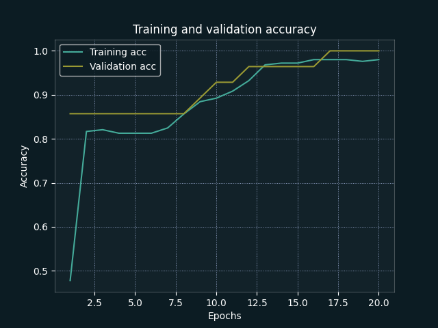
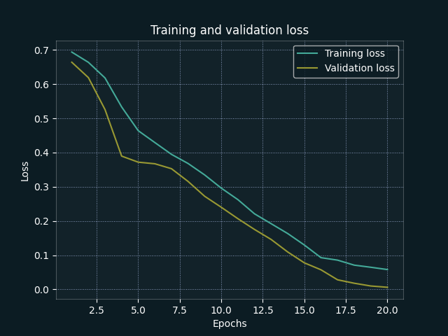
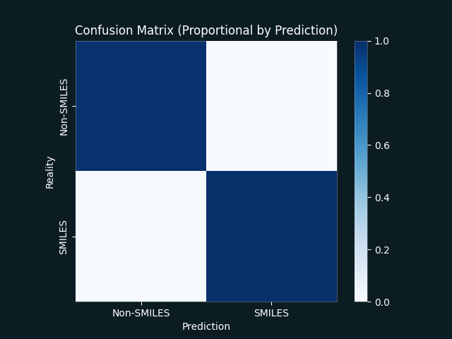
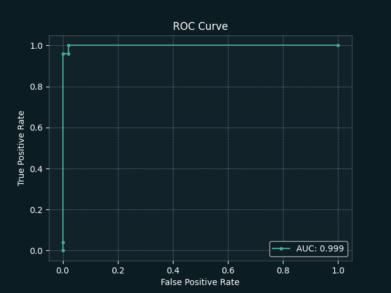

# BinaryStringClassifier 🔣

An exploration into SMILES detection using a LSTM neural network.

## Functionality
- `BSC-Data`: Entrypoint for dataset creation and curation.
	- `create`: Create randomly generated datasets within given parameters.
	- `combine`: Combine multiple components datasets into one ready for training.
	- `evaluate`: Generate summary information for given a dataset.
	- `split`: Perform train/test split for a given dataset.
- `BSC-Model`: Entrypoint for model training & evaluation.
	- `train`: Train a BinaryStringClassifier model.
	- `evaluate`: Evaluate a trained BinaryStringClassifier model.
	- `predict`: Get SMILES probabilities with a trained BinaryStringClassifier model

## Example Plots
|     |     |
| --- | --- |
|  |  |
|  |  |
